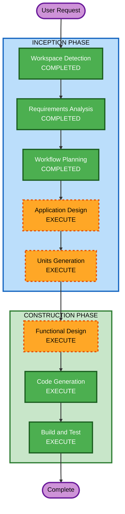

# Execution Plan

## Detailed Analysis Summary

### Change Impact Assessment
- **User-facing changes**: Yes — 고객용 주문 UI + 관리자 대시보드 신규 개발
- **Structural changes**: Yes — 전체 시스템 아키텍처 신규 설계 (FastAPI + Vue.js + MySQL)
- **Data model changes**: Yes — 매장, 테이블, 메뉴, 주문, 사용자 등 전체 스키마 신규
- **API changes**: Yes — REST API 전체 신규 설계
- **NFR impact**: Low — 소규모 실습 환경, SSE 실시간 통신 정도

### Risk Assessment
- **Risk Level**: Low (실습 프로젝트, 프로덕션 배포 없음)
- **Rollback Complexity**: Easy (Greenfield, 기존 시스템 없음)
- **Testing Complexity**: Moderate (다수 기능이지만 소규모 환경)

## Workflow Visualization



### Text Alternative
```
Phase 1: INCEPTION
  - Workspace Detection (COMPLETED)
  - Requirements Analysis (COMPLETED)
  - Workflow Planning (COMPLETED)
  - Application Design (EXECUTE)
  - Units Generation (EXECUTE)

Phase 2: CONSTRUCTION
  - Functional Design (EXECUTE, per-unit)
  - Code Generation (EXECUTE, per-unit)
  - Build and Test (EXECUTE)
```

## Phases to Execute

### INCEPTION PHASE
- [x] Workspace Detection (COMPLETED)
- [x] Requirements Analysis (COMPLETED)
- [x] Workflow Planning (COMPLETED)
- [ ] Application Design - EXECUTE
  - **Rationale**: 신규 프로젝트로 컴포넌트 식별, 서비스 레이어 설계, API 엔드포인트 정의 필요
- [ ] Units Generation - EXECUTE
  - **Rationale**: 백엔드/프론트엔드/인프라 등 복수 유닛으로 분해 필요

### INCEPTION PHASE — SKIP
- Reverse Engineering - SKIP
  - **Rationale**: Greenfield 프로젝트, 기존 코드 없음
- User Stories - SKIP
  - **Rationale**: 실습 프로젝트, 요구사항 문서가 이미 상세하게 기능별 정의됨

### CONSTRUCTION PHASE
- [ ] Functional Design - EXECUTE (per-unit)
  - **Rationale**: 데이터 모델, 비즈니스 로직, API 상세 설계 필요
- [ ] NFR Requirements - SKIP
  - **Rationale**: 소규모 실습 환경, Security/PBT 미적용, 별도 NFR 설계 불필요
- [ ] NFR Design - SKIP
  - **Rationale**: NFR Requirements 미실행
- [ ] Infrastructure Design - SKIP
  - **Rationale**: Docker Compose 로컬 환경으로 단순, 별도 인프라 설계 불필요
- [ ] Code Generation - EXECUTE (per-unit, ALWAYS)
  - **Rationale**: 실제 코드 구현
- [ ] Build and Test - EXECUTE (ALWAYS)
  - **Rationale**: 빌드 및 테스트 지침 생성

### OPERATIONS PHASE
- [ ] Operations - PLACEHOLDER

## Success Criteria
- **Primary Goal**: 로컬 환경에서 동작하는 테이블오더 시스템 완성
- **Key Deliverables**: FastAPI 백엔드, Vue.js 프론트엔드, MySQL 스키마, Docker Compose 설정
- **Quality Gates**: 고객 주문 플로우 동작, 관리자 실시간 모니터링 동작, SSE 통신 동작
